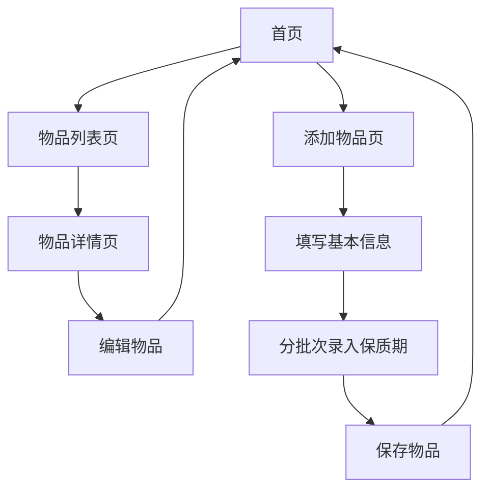

## 1. 产品概述
小管家是一款家庭物品管理微信小程序，帮助用户记录和管理家庭物品信息。
- 主要功能包括物品信息录入、分类管理、数量跟踪、存放地点记录和保质期提醒。
- 解决家庭物品管理混乱、过期物品浪费等问题，目标用户为需要管理家庭物品的家庭成员。

## 2. 核心功能

### 2.1 用户角色
| 角色 | 注册方式 | 核心权限 |
|------|---------------------|------------------|
| 普通用户 | 微信登录 | 物品管理、查看提醒、编辑物品 |

### 2.2 功能模块
1. **首页**：物品总览、临期提醒、快速添加物品
2. **物品列表页**：分类查看物品、搜索物品、编辑物品
3. **物品详情页**：查看物品详细信息、编辑物品信息
4. **添加物品页**：录入物品信息、分批次录入保质期

### 2.3 页面详情
| 页面名称 | 模块名称 | 功能描述 |
|-----------|-------------|---------------------|
| 首页 | 物品总览 | 显示物品总数、分类统计、临期物品数量 |
| 首页 | 临期提醒 | 显示即将过期的物品列表，按过期时间排序 |
| 首页 | 快速添加 | 提供快速添加物品的入口 |
| 物品列表页 | 分类筛选 | 按分类筛选物品，支持自定义分类 |
| 物品列表页 | 搜索功能 | 按名称、存放地点搜索物品 |
| 物品列表页 | 物品操作 | 支持查看详情、编辑、删除物品 |
| 物品详情页 | 信息展示 | 显示物品所有详细信息 |
| 物品详情页 | 编辑功能 | 编辑物品信息，包括名称、分类、数量、存放地点、保质期 |
| 添加物品页 | 基本信息 | 录入物品名称、分类、数量、存放地点 |
| 添加物品页 | 保质期管理 | 支持分批次录入不同保质期的物品 |
| 设置页 | 分类管理 | 查看、添加、编辑、删除自定义分类 |
| 设置页 | 存放地点管理 | 查看、添加、编辑、删除自定义存放地点 |

## 3. 核心流程
用户打开小程序 → 查看首页物品总览和临期提醒 → 进入物品列表查看所有物品 → 点击添加按钮录入新物品 → 填写基本信息并分批次设置保质期 → 保存物品信息 → 系统自动计算临期提醒 → 用户可随时编辑已录入物品

## 4. 用户界面设计
### 4.1 设计风格
- 主色调：#4CAF50（绿色）、#FFFFFF（白色）
- 辅助色：#FF9800（橙色，用于提醒）、#E0E0E0（灰色，用于背景）
- 按钮样式：圆角矩形，轻微阴影
- 字体：微信默认字体，标题16-18px，正文14px，辅助文字12px
- 布局风格：卡片式布局，顶部导航栏
- 图标风格：线性图标，简洁明了

### 4.2 页面设计概览
| 页面名称 | 模块名称 | UI元素 |
|-----------|-------------|-------------|
| 首页 | 物品总览 | 卡片式布局，显示物品总数、分类数量、临期物品数量，使用图标+数字组合 |
| 首页 | 临期提醒 | 橙色背景卡片，显示临期物品列表，每条包含物品名称、剩余天数、存放地点 |
| 首页 | 快速添加 | 底部固定的"+"按钮，圆形，主色调背景 |
| 物品列表页 | 分类筛选 | 顶部横向滚动的分类标签，选中状态有下划线 |
| 物品列表页 | 搜索功能 | 顶部搜索框，带搜索图标 |
| 物品列表页 | 物品列表 | 卡片式列表，每条显示物品名称、分类、数量、存放地点、保质期状态 |
| 物品详情页 | 信息展示 | 垂直布局，每条信息占一行，标签+内容格式 |
| 物品详情页 | 编辑按钮 | 顶部右侧编辑图标 |
| 添加物品页 | 基本信息 | 表单布局，输入框+标签，带必填标识 |
| 添加物品页 | 保质期管理 | 列表式布局，每批次显示数量、保质期，可添加/删除批次 |

### 4.3 响应式设计
- 移动端优先设计，适配不同尺寸的手机屏幕
- 触摸优化，按钮和可点击区域大小合适
- 垂直滚动布局，避免横向滚动

### 4.4 3D场景指导
- 无3D场景需求