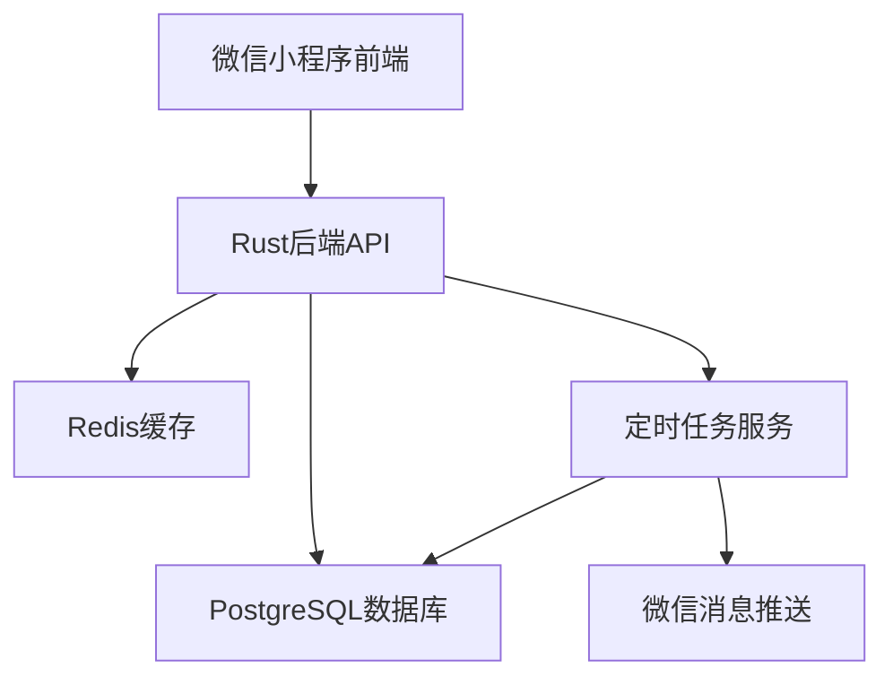
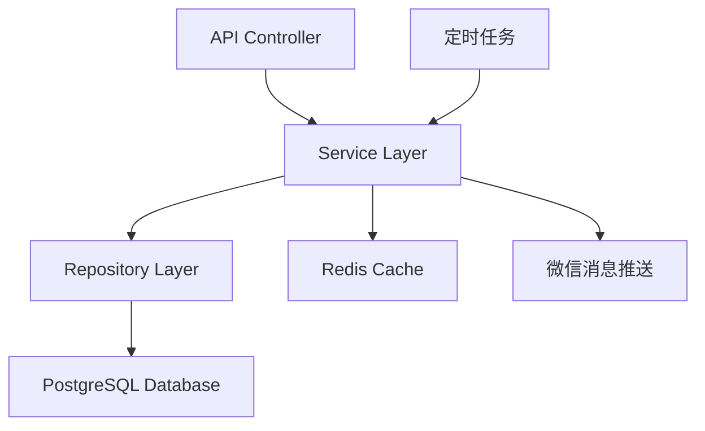
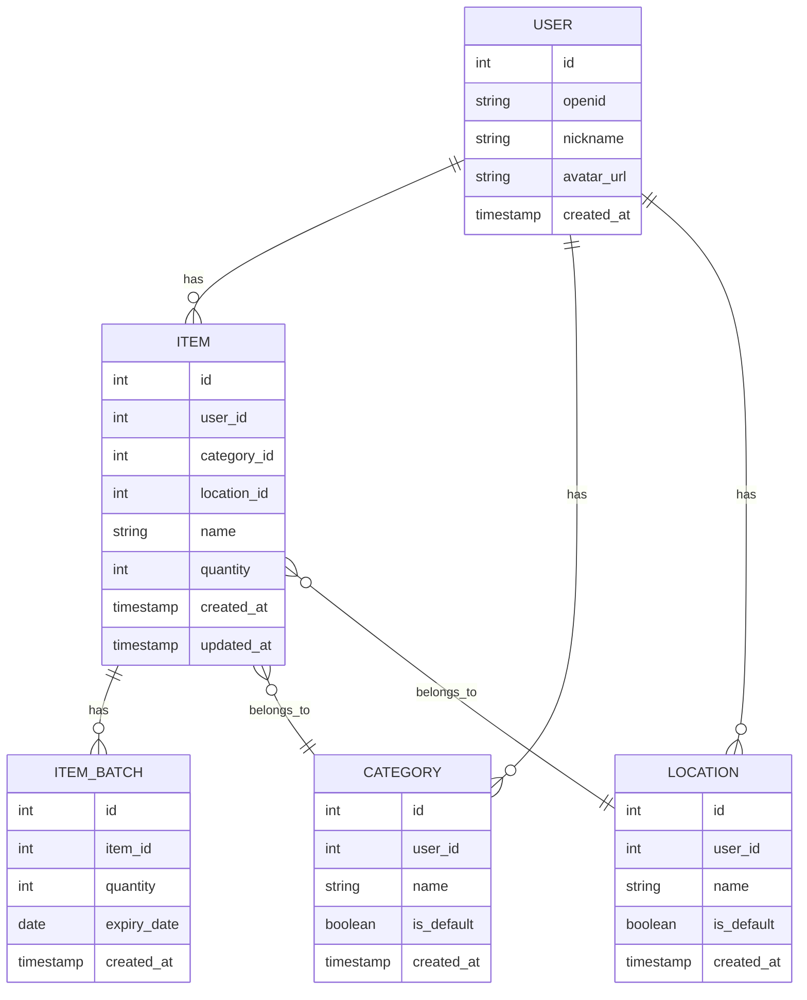

## 1. 架构设计


## 2. 技术描述
- 前端：微信小程序原生开发
- 后端：Rust + Rocket框架
- 数据库：PostgreSQL 14+
- 缓存：Redis
- 认证：微信小程序登录
- 部署：Nginx反向代理

## 3. 路由定义
| 路由 | 目的 |
|-------|---------|
| /api/auth/login | 微信登录 |
| /api/items | 获取物品列表 |
| /api/items/:id | 获取物品详情 |
| /api/items | 添加物品 |
| /api/items/:id | 更新物品 |
| /api/items/:id | 删除物品 |
| /api/items/expiring | 获取临期物品 |
| /api/categories | 获取分类列表 |
| /api/categories | 添加分类 |
| /api/categories/:id | 更新分类 |
| /api/categories/:id | 删除分类 |
| /api/locations | 获取存放地点列表 |
| /api/locations | 添加存放地点 |
| /api/locations/:id | 更新存放地点 |
| /api/locations/:id | 删除存放地点 |

## 4. API定义
### 4.1 认证API
- **POST /api/auth/login**
  - 请求体：`{"code": "微信登录code"}`
  - 响应：`{"token": "JWT token", "user_id": "用户ID"}`

### 4.2 物品API
- **GET /api/items**
  - 查询参数：`category`、`search`、`page`、`limit`
  - 响应：`{"items": [...], "total": 100}`

- **GET /api/items/:id**
  - 响应：`{"id": 1, "name": "物品名称", "category": "分类", "quantity": 10, "location": "存放地点", "batches": [...]}`

- **POST /api/items**
  - 请求体：`{"name": "物品名称", "category": "分类", "quantity": 10, "location": "存放地点", "batches": [{"quantity": 5, "expiry_date": "2026-12-31"}]}`
  - 响应：`{"id": 1, ...}`

- **PUT /api/items/:id**
  - 请求体：`{"name": "物品名称", "category": "分类", "quantity": 10, "location": "存放地点", "batches": [{"quantity": 5, "expiry_date": "2026-12-31"}]}`
  - 响应：`{"id": 1, ...}`

- **DELETE /api/items/:id**
  - 响应：`{"success": true}`

### 4.3 分类API
- **GET /api/categories**
  - 响应：`{"categories": [{"id": 1, "name": "食品", "is_default": true}, ...]}`

- **POST /api/categories**
  - 请求体：`{"name": "新分类"}`
  - 响应：`{"id": 1, "name": "新分类", "is_default": false}`

- **PUT /api/categories/:id**
  - 请求体：`{"name": "更新分类"}`
  - 响应：`{"id": 1, "name": "更新分类"}`

- **DELETE /api/categories/:id**
  - 响应：`{"success": true}`

### 4.4 存放地点API
- **GET /api/locations**
  - 响应：`{"locations": [{"id": 1, "name": "厨房", "is_default": true}, ...]}`

- **POST /api/locations**
  - 请求体：`{"name": "新存放地点"}`
  - 响应：`{"id": 1, "name": "新存放地点", "is_default": false}`

- **PUT /api/locations/:id**
  - 请求体：`{"name": "更新存放地点"}`
  - 响应：`{"id": 1, "name": "更新存放地点"}`

- **DELETE /api/locations/:id**
  - 响应：`{"success": true}`

### 4.5 临期API
- **GET /api/items/expiring**
  - 查询参数：`days`（默认7天）
  - 响应：`{"items": [...]}`

## 5. 服务器架构图


## 6. 数据模型
### 6.1 数据模型定义


### 6.2 数据定义语言
```sql
-- 用户表
CREATE TABLE users (
    id SERIAL PRIMARY KEY,
    openid VARCHAR(255) UNIQUE NOT NULL,
    nickname VARCHAR(255),
    avatar_url VARCHAR(512),
    created_at TIMESTAMP DEFAULT CURRENT_TIMESTAMP
);

-- 分类表
CREATE TABLE categories (
    id SERIAL PRIMARY KEY,
    user_id INTEGER REFERENCES users(id),
    name VARCHAR(100) NOT NULL,
    is_default BOOLEAN DEFAULT false,
    created_at TIMESTAMP DEFAULT CURRENT_TIMESTAMP,
    UNIQUE(user_id, name)
);

-- 存放地点表
CREATE TABLE locations (
    id SERIAL PRIMARY KEY,
    user_id INTEGER REFERENCES users(id),
    name VARCHAR(255) NOT NULL,
    is_default BOOLEAN DEFAULT false,
    created_at TIMESTAMP DEFAULT CURRENT_TIMESTAMP,
    UNIQUE(user_id, name)
);

-- 物品表
CREATE TABLE items (
    id SERIAL PRIMARY KEY,
    user_id INTEGER REFERENCES users(id),
    category_id INTEGER REFERENCES categories(id),
    location_id INTEGER REFERENCES locations(id),
    name VARCHAR(255) NOT NULL,
    quantity INTEGER NOT NULL DEFAULT 0,
    created_at TIMESTAMP DEFAULT CURRENT_TIMESTAMP,
    updated_at TIMESTAMP DEFAULT CURRENT_TIMESTAMP
);

-- 物品批次表
CREATE TABLE item_batches (
    id SERIAL PRIMARY KEY,
    item_id INTEGER REFERENCES items(id) ON DELETE CASCADE,
    quantity INTEGER NOT NULL,
    expiry_date DATE NOT NULL,
    created_at TIMESTAMP DEFAULT CURRENT_TIMESTAMP
);

-- 索引
CREATE INDEX idx_items_user_id ON items(user_id);
CREATE INDEX idx_items_category_id ON items(category_id);
CREATE INDEX idx_items_location_id ON items(location_id);
CREATE INDEX idx_item_batches_item_id ON item_batches(item_id);
CREATE INDEX idx_item_batches_expiry_date ON item_batches(expiry_date);
CREATE INDEX idx_categories_user_id ON categories(user_id);
CREATE INDEX idx_locations_user_id ON locations(user_id);

-- 预设分类数据
INSERT INTO categories (user_id, name, is_default) VALUES
    (NULL, '食品', true),
    (NULL, '生活用品', true),
    (NULL, '药品', true),
    (NULL, '电子产品', true),
    (NULL, '其他', true);

-- 预设存放地点数据
INSERT INTO locations (user_id, name, is_default) VALUES
    (NULL, '厨房', true),
    (NULL, '卧室', true),
    (NULL, '客厅', true),
    (NULL, '卫生间', true),
    (NULL, '储物间', true);
```